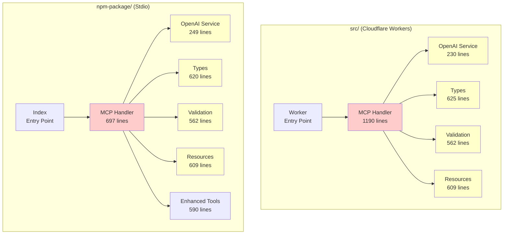
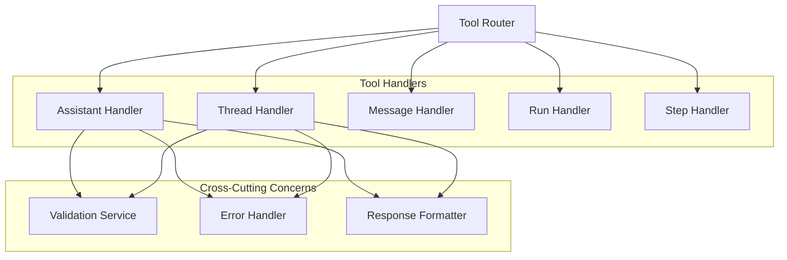
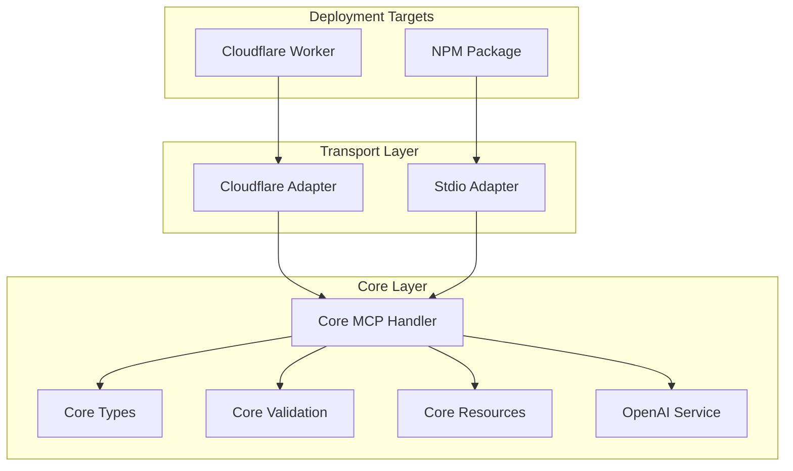

# 🏗️ Architectural Analysis: OpenAI Assistants MCP Server

## Executive Summary

This architectural review identifies significant coupling issues and design concerns in the OpenAI Assistants MCP Server codebase. The analysis reveals a dual deployment architecture that creates unnecessary complexity, a monolithic 461-line method that violates single responsibility principles, and tight coupling between validation, types, and business logic layers.

## 🔍 Key Findings

### Critical Issues
1. **Monolithic `handleToolsCall` Method** - 461 lines violating SRP
2. **Dual Deployment Coupling** - Unnecessary code duplication between `src/` and `npm-package/`
3. **Tight Validation Coupling** - Validation logic embedded throughout business logic
4. **Configuration Inconsistencies** - Different configuration patterns across deployments
5. **Resource System Isolation** - Resources tightly coupled to MCP protocol specifics

### Architecture Strengths
1. **Clear Type Definitions** - Comprehensive TypeScript interfaces
2. **Consistent Error Handling** - Standardized MCP error responses
3. **Modular OpenAI Service** - Well-encapsulated API interactions

## 📊 Component Dependency Analysis

### Current Architecture Diagram



### Coupling Analysis Matrix

| Component | MCP Handler | OpenAI Service | Types | Validation | Resources |
|-----------|-------------|----------------|-------|------------|-----------|
| **MCP Handler** | - | High | High | High | Medium |
| **OpenAI Service** | - | - | High | Low | None |
| **Types** | - | - | - | Medium | Low |
| **Validation** | - | - | High | - | None |
| **Resources** | - | - | Low | None | - |

**Legend:** High = Tight coupling, Medium = Moderate coupling, Low = Loose coupling, None = No coupling

## 🚨 Architectural Anti-Patterns Identified

### 1. God Object: `handleToolsCall` Method

**Location:** Both `src/mcp-handler.ts:692-1153` and `npm-package/src/mcp-handler.ts:171-633`

**Issues:**
- **461 lines** in src version, **462 lines** in npm-package version
- Handles 22 different tool operations in a single method
- Massive switch statement with repetitive validation patterns
- Violates Single Responsibility Principle
- Difficult to test, maintain, and extend

**Code Smell Example:**
```typescript
// 461-line method handling everything
private async handleToolsCall(request: MCPToolsCallRequest): Promise<MCPToolsCallResponse> {
  const { name, arguments: args } = request.params;
  try {
    let result: any;
    switch (name) {
      case 'assistant-create':
        // 50+ lines of validation and logic
      case 'assistant-list':
        // 30+ lines of validation and logic
      // ... 20 more cases
    }
  }
}
```

### 2. Shotgun Surgery: Dual Deployment Architecture

**Problem:** Nearly identical code exists in both `src/` and `npm-package/` directories with subtle differences.

**Duplication Analysis:**
- **Types**: 99.2% identical (625 vs 620 lines)
- **Validation**: 100% identical (562 lines each)
- **Resources**: 100% identical (609 lines each)
- **OpenAI Service**: 92% identical (230 vs 249 lines)
- **MCP Handler**: 65% identical (different architectures)

**Impact:**
- Bug fixes must be applied in two places
- Feature additions require dual implementation
- Inconsistent behavior between deployments
- Maintenance overhead

### 3. Feature Envy: Validation Coupling

**Problem:** MCP Handler extensively uses validation functions, suggesting validation logic should be closer to the handler.

**Evidence:**
```typescript
// MCP Handler imports 8 validation functions
import {
  validateOpenAIId,
  validateModel,
  validateCreateAssistantParams,
  validateRequiredString,
  validateMessageRole,
  validatePaginationParams,
  validateArray,
  validateMetadata,
  ValidationResult
} from './validation.js';

// Then uses them extensively throughout handleToolsCall
const createAssistantValidation = validateCreateAssistantParams(args);
const listAssistantsValidation = validatePaginationParams(args);
const getAssistantValidation = validateOpenAIId(args.assistant_id, 'assistant', 'assistant_id');
```

### 4. Inappropriate Intimacy: Types and Business Logic

**Problem:** Business logic is tightly coupled to specific type definitions, making changes difficult.

**Evidence:**
- 25+ type imports in MCP Handler
- Direct manipulation of complex nested types
- Type-specific validation logic scattered throughout

## 🔧 Specific Architectural Issues

### 1. Single Responsibility Violations

#### MCP Handler Class
**Current Responsibilities:**
1. MCP protocol handling
2. Request routing
3. Parameter validation
4. OpenAI API orchestration
5. Error handling
6. Response formatting
7. Resource management (npm-package version)
8. Proxy mode handling (npm-package version)

**Recommendation:** Split into focused classes with single responsibilities.

#### handleToolsCall Method
**Current Responsibilities:**
1. Tool name routing
2. Parameter validation for 22 different tools
3. OpenAI service method calls
4. Error handling
5. Response formatting

### 2. Interface Segregation Issues

**Problem:** Large, monolithic interfaces force implementations to depend on methods they don't use.

**Example:**
```typescript
// MCPHandler depends on entire OpenAI service interface
// even though different tools only use specific methods
class MCPHandler {
  private openaiService: OpenAIService; // Full interface dependency
}
```

### 3. Dependency Inversion Violations

**Problem:** High-level modules (MCP Handler) depend directly on low-level modules (OpenAI Service) rather than abstractions.

**Current:**
```typescript
import { OpenAIService } from './openai-service.js'; // Concrete dependency
```

**Should be:**
```typescript
interface IOpenAIService { /* abstraction */ }
class MCPHandler {
  constructor(private openaiService: IOpenAIService) {} // Depend on abstraction
}
```

### 4. Configuration Management Issues

**Inconsistencies between deployments:**

#### Cloudflare Workers (src/)
```typescript
// Environment-based configuration
interface Env {
  OPENAI_API_KEY: string;
}
```

#### NPM Package (npm-package/)
```typescript
// Constructor-based configuration
constructor(apiKey: string) {
  if (apiKey === 'CLOUDFLARE_PROXY_MODE') {
    this.isProxyMode = true;
  }
}
```

## 📈 Proposed Architecture Improvements

### 1. Decompose God Object

#### Current Structure
```
handleToolsCall (461 lines)
├── 22 tool cases
├── Validation logic
├── OpenAI service calls
└── Response formatting
```

#### Proposed Structure


#### Implementation Example
```typescript
// Tool Router
class ToolRouter {
  private handlers = new Map<string, IToolHandler>();
  
  constructor() {
    this.handlers.set('assistant-create', new AssistantHandler());
    this.handlers.set('assistant-list', new AssistantHandler());
    // ... other handlers
  }
  
  async route(toolName: string, args: any): Promise<any> {
    const handler = this.handlers.get(toolName);
    if (!handler) {
      throw new MCPError(ErrorCodes.METHOD_NOT_FOUND, `Tool not found: ${toolName}`);
    }
    return handler.handle(args);
  }
}

// Individual Tool Handler
class AssistantHandler implements IToolHandler {
  constructor(
    private openaiService: IOpenAIService,
    private validator: IValidationService
  ) {}
  
  async handle(toolName: string, args: any): Promise<any> {
    switch (toolName) {
      case 'assistant-create':
        return this.createAssistant(args);
      case 'assistant-list':
        return this.listAssistants(args);
      // ... other assistant operations
    }
  }
  
  private async createAssistant(args: any): Promise<Assistant> {
    this.validator.validateCreateAssistant(args);
    return this.openaiService.createAssistant(args);
  }
}
```

### 2. Eliminate Dual Deployment Coupling

#### Proposed Unified Architecture


#### Implementation Strategy
```typescript
// Core business logic (shared)
abstract class BaseMCPHandler {
  protected abstract transport: ITransport;
  
  async handleRequest(request: MCPRequest): Promise<MCPResponse> {
    // Common logic here
  }
}

// Transport-specific implementations
class CloudflareHandler extends BaseMCPHandler {
  protected transport = new CloudflareTransport();
}

class StdioHandler extends BaseMCPHandler {
  protected transport = new StdioTransport();
}
```

### 3. Improve Validation Architecture

#### Current Issues
- Validation scattered throughout business logic
- Repetitive validation patterns
- Tight coupling between validation and MCP handler

#### Proposed Solution
```typescript
// Validation Service with Strategy Pattern
interface IValidationStrategy {
  validate(args: any): ValidationResult;
}

class ValidationService {
  private strategies = new Map<string, IValidationStrategy>();
  
  constructor() {
    this.strategies.set('assistant-create', new CreateAssistantValidator());
    this.strategies.set('assistant-list', new ListAssistantsValidator());
    // ... other validators
  }
  
  validate(toolName: string, args: any): ValidationResult {
    const strategy = this.strategies.get(toolName);
    if (!strategy) {
      throw new Error(`No validator for tool: ${toolName}`);
    }
    return strategy.validate(args);
  }
}

// Specific validator implementations
class CreateAssistantValidator implements IValidationStrategy {
  validate(args: any): ValidationResult {
    // Focused validation logic
    return validateCreateAssistantParams(args);
  }
}
```

### 4. Implement Proper Dependency Injection

```typescript
// Service interfaces
interface IOpenAIService {
  createAssistant(request: CreateAssistantRequest): Promise<Assistant>;
  // ... other methods
}

interface IValidationService {
  validate(toolName: string, args: any): ValidationResult;
}

interface IResourceService {
  getResource(uri: string): MCPResource | null;
}

// Dependency injection container
class ServiceContainer {
  private services = new Map<string, any>();
  
  register<T>(key: string, service: T): void {
    this.services.set(key, service);
  }
  
  get<T>(key: string): T {
    return this.services.get(key);
  }
}

// Updated MCP Handler
class MCPHandler {
  constructor(
    private openaiService: IOpenAIService,
    private validationService: IValidationService,
    private resourceService: IResourceService,
    private toolRouter: IToolRouter
  ) {}
  
  async handleToolsCall(request: MCPToolsCallRequest): Promise<MCPToolsCallResponse> {
    const { name, arguments: args } = request.params;
    
    // Validate request
    const validation = this.validationService.validate(name, args);
    if (!validation.isValid) {
      throw validation.error;
    }
    
    // Route to appropriate handler
    const result = await this.toolRouter.route(name, args);
    
    return this.formatResponse(request.id, result);
  }
}
```

## 🎯 Implementation Roadmap

### Phase 1: Decompose God Object (High Priority)
1. **Extract Tool Handlers** (2-3 days)
   - Create `IToolHandler` interface
   - Implement `AssistantHandler`, `ThreadHandler`, etc.
   - Create `ToolRouter` class

2. **Implement Validation Service** (1-2 days)
   - Extract validation strategies
   - Create `ValidationService` with strategy pattern
   - Remove validation logic from MCP handler

### Phase 2: Eliminate Duplication (Medium Priority)
1. **Create Core Layer** (3-4 days)
   - Extract shared business logic
   - Create transport abstractions
   - Implement adapter pattern for different transports

2. **Refactor Deployment Targets** (2-3 days)
   - Update Cloudflare Workers to use core layer
   - Update NPM package to use core layer
   - Remove duplicated code

### Phase 3: Improve Architecture (Lower Priority)
1. **Implement Dependency Injection** (2-3 days)
   - Create service container
   - Define service interfaces
   - Update constructors and dependencies

2. **Enhance Configuration Management** (1-2 days)
   - Standardize configuration patterns
   - Create configuration service
   - Support environment-specific settings

## 📋 Specific Recommendations

### Immediate Actions (Next Sprint)
1. **Break down `handleToolsCall`** into smaller, focused methods
2. **Extract validation logic** into dedicated service
3. **Create tool handler interfaces** for better testability
4. **Standardize error handling** patterns

### Short-term Goals (Next Month)
1. **Eliminate code duplication** between src/ and npm-package/
2. **Implement proper dependency injection**
3. **Create comprehensive unit tests** for each component
4. **Establish clear architectural boundaries**

### Long-term Vision (Next Quarter)
1. **Plugin architecture** for extensible tool handlers
2. **Event-driven architecture** for better decoupling
3. **Microservice decomposition** if complexity grows
4. **Performance optimization** through caching and batching

## 🧪 Testing Strategy

### Current Testing Gaps
- No unit tests for individual components
- Integration tests only at system level
- Validation logic not independently tested
- Error handling scenarios not covered

### Proposed Testing Architecture
```typescript
// Unit Tests
describe('AssistantHandler', () => {
  let handler: AssistantHandler;
  let mockOpenAIService: jest.Mocked<IOpenAIService>;
  let mockValidator: jest.Mocked<IValidationService>;
  
  beforeEach(() => {
    mockOpenAIService = createMockOpenAIService();
    mockValidator = createMockValidator();
    handler = new AssistantHandler(mockOpenAIService, mockValidator);
  });
  
  it('should create assistant with valid parameters', async () => {
    // Test implementation
  });
});

// Integration Tests
describe('MCPHandler Integration', () => {
  it('should handle complete assistant creation workflow', async () => {
    // End-to-end test
  });
});
```

## 📊 Metrics and Success Criteria

### Code Quality Metrics
- **Cyclomatic Complexity**: Reduce from 25+ to <10 per method
- **Lines of Code per Method**: Reduce from 461 to <50
- **Coupling Metrics**: Reduce afferent/efferent coupling by 60%
- **Test Coverage**: Achieve 90%+ coverage for core components

### Maintainability Metrics
- **Code Duplication**: Eliminate 95% of duplicated code
- **Change Impact**: Reduce change impact radius by 70%
- **Build Time**: Maintain current build performance
- **Bundle Size**: Reduce by 15% through better tree-shaking

## 🔚 Conclusion

The OpenAI Assistants MCP Server demonstrates solid functionality but suffers from significant architectural debt. The monolithic `handleToolsCall` method, dual deployment coupling, and scattered validation logic create maintenance challenges and hinder extensibility.

The proposed refactoring plan addresses these issues through:
1. **Decomposition** of large components into focused, single-responsibility classes
2. **Elimination** of code duplication through shared core layer
3. **Improved separation** of concerns with proper dependency injection
4. **Enhanced testability** through better architectural boundaries

Implementing these changes will result in a more maintainable, extensible, and robust codebase that can better support future feature development and deployment scenarios.

---

**Next Steps:** Review this analysis with the development team and prioritize implementation phases based on business impact and development capacity.