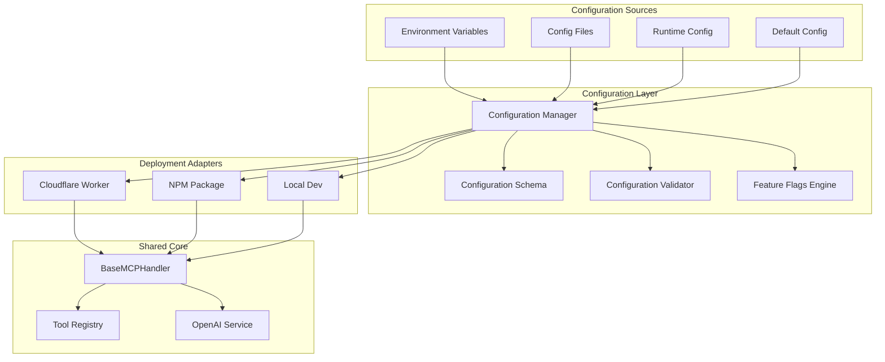

# Phase 2: Configuration Management - Architectural Design

## 🎯 Overview

Phase 2 transforms the OpenAI Assistants MCP Server from a hardcoded configuration approach to a sophisticated, centralized configuration management system with dynamic feature flags, environment-specific settings, and runtime configuration capabilities.

## 🔍 Current State Analysis

### Configuration Patterns Identified:
1. **Hardcoded Configuration** - Static values scattered across deployment adapters
2. **Environment-Specific Duplication** - Similar config blocks in both adapters
3. **Limited Feature Flags** - Basic debug flag only
4. **Manual Environment Management** - wrangler.toml environments require manual updates
5. **No Runtime Configuration** - No ability to update config without restart

### Current Configuration Sources:
- `wrangler.toml` - Cloudflare Workers environments (development, staging, production)
- `BaseMCPHandlerConfig` interface - Core handler configuration
- Environment variables - `OPENAI_API_KEY`, `DEBUG`, `ENVIRONMENT`
- Hardcoded values in adapters - Server names, versions, capabilities

## 🏗️ Architecture Design

### 1. Centralized Configuration System



### 2. Configuration Schema Design

#### Core Configuration Interface
```typescript
interface MCPServerConfig {
  // Server Identity
  server: {
    name: string;
    version: string;
    description?: string;
    environment: 'development' | 'staging' | 'production' | 'test';
  };
  
  // API Configuration
  api: {
    openai: {
      apiKey: string;
      baseUrl?: string;
      timeout?: number;
      retries?: number;
    };
  };
  
  // Feature Flags
  features: {
    tools: {
      enabled: boolean;
      listChanged: boolean;
      categories?: string[];
      rateLimit?: number;
    };
    resources: {
      enabled: boolean;
      subscribe: boolean;
      listChanged: boolean;
      maxSize?: number;
    };
    prompts: {
      enabled: boolean;
      listChanged: boolean;
      caching?: boolean;
    };
    completions: {
      enabled: boolean;
      streaming?: boolean;
    };
    validation: {
      enabled: boolean;
      strict: boolean;
      schemas?: boolean;
    };
    monitoring: {
      enabled: boolean;
      metrics: boolean;
      logging: boolean;
      tracing?: boolean;
    };
  };
  
  // Performance Configuration
  performance: {
    pagination: {
      defaultLimit: number;
      maxLimit: number;
    };
    caching: {
      enabled: boolean;
      ttl: number;
      maxSize: number;
    };
    concurrency: {
      maxConcurrentRequests: number;
      requestTimeout: number;
    };
  };
  
  // Security Configuration
  security: {
    cors: {
      enabled: boolean;
      origins: string[];
      methods: string[];
    };
    rateLimit: {
      enabled: boolean;
      requests: number;
      window: number;
    };
    validation: {
      strictMode: boolean;
      sanitizeInputs: boolean;
    };
  };
  
  // Deployment-Specific
  deployment: {
    type: 'cloudflare' | 'npm' | 'local';
    transport: 'http' | 'stdio';
    debug: boolean;
    logLevel: 'error' | 'warn' | 'info' | 'debug';
  };
  
  // Runtime Configuration
  runtime: {
    hotReload: boolean;
    configRefreshInterval?: number;
    gracefulShutdown: boolean;
  };
}
```

### 3. Configuration Manager Architecture

#### Configuration Manager Class
```typescript
class ConfigurationManager {
  private config: MCPServerConfig;
  private schema: ConfigurationSchema;
  private validator: ConfigurationValidator;
  private featureFlags: FeatureFlagsEngine;
  private watchers: ConfigurationWatcher[];
  
  // Configuration loading and merging
  async loadConfiguration(environment: string): Promise<MCPServerConfig>
  
  // Feature flag management
  isFeatureEnabled(feature: string): boolean
  getFeatureConfig<T>(feature: string): T
  
  // Runtime configuration updates
  updateConfiguration(updates: Partial<MCPServerConfig>): void
  watchConfiguration(callback: ConfigChangeCallback): void
  
  // Environment-specific configuration
  getEnvironmentConfig(env: string): EnvironmentConfig
  validateEnvironmentConfig(config: MCPServerConfig): ValidationResult
}
```

### 4. Feature Flags Engine

#### Dynamic Feature Management
```typescript
class FeatureFlagsEngine {
  private flags: Map<string, FeatureFlag>;
  private rules: FeatureFlagRule[];
  private evaluator: FeatureFlagEvaluator;
  
  // Feature flag evaluation
  evaluate(flagName: string, context: EvaluationContext): boolean
  
  // A/B testing support
  getVariant(flagName: string, context: EvaluationContext): string
  
  // Runtime flag updates
  updateFlag(flagName: string, flag: FeatureFlag): void
  
  // Flag analytics
  trackFlagUsage(flagName: string, result: boolean): void
}
```

### 5. Environment-Specific Configuration

#### Configuration Hierarchy
```
1. Default Configuration (shared/config/defaults.ts)
2. Environment Configuration (shared/config/environments/{env}.ts)
3. Deployment Configuration (deployment-specific overrides)
4. Runtime Configuration (dynamic updates)
5. Environment Variables (highest priority)
```

#### Environment Configuration Files
```typescript
// shared/config/environments/development.ts
export const developmentConfig: Partial<MCPServerConfig> = {
  server: {
    environment: 'development',
  },
  features: {
    monitoring: {
      enabled: true,
      metrics: true,
      logging: true,
      tracing: true,
    },
    validation: {
      enabled: true,
      strict: false,
      schemas: true,
    },
  },
  deployment: {
    debug: true,
    logLevel: 'debug',
  },
  runtime: {
    hotReload: true,
    configRefreshInterval: 5000,
  },
};
```

### 6. Configuration Validation System

#### Schema-Based Validation
```typescript
class ConfigurationValidator {
  private schema: JSONSchema7;
  private ajv: Ajv;
  
  // Configuration validation
  validate(config: MCPServerConfig): ValidationResult
  
  // Environment-specific validation
  validateEnvironment(config: MCPServerConfig, env: string): ValidationResult
  
  // Feature flag validation
  validateFeatureFlags(flags: FeatureFlags): ValidationResult
  
  // Security validation
  validateSecurityConfig(security: SecurityConfig): ValidationResult
}
```

## 🚀 Implementation Strategy

### Phase 2.1: Core Configuration Infrastructure (Week 5)
1. **Configuration Manager Implementation**
   - Create centralized configuration manager
   - Implement configuration loading and merging
   - Add configuration validation system

2. **Schema Definition**
   - Define comprehensive configuration schema
   - Create TypeScript interfaces
   - Add JSON schema for validation

### Phase 2.2: Feature Flags Engine (Week 6)
1. **Feature Flag System**
   - Implement feature flags engine
   - Add runtime flag evaluation
   - Create flag management utilities

2. **A/B Testing Support**
   - Add variant management
   - Implement evaluation contexts
   - Create flag analytics

### Phase 2.3: Environment Management (Week 7)
1. **Environment-Specific Configuration**
   - Create environment configuration files
   - Implement environment detection
   - Add environment validation

2. **Deployment Integration**
   - Update Cloudflare Workers adapter
   - Update NPM package adapter
   - Add local development support

### Phase 2.4: Runtime Configuration (Week 8)
1. **Hot Configuration Reloading**
   - Implement configuration watchers
   - Add runtime configuration updates
   - Create configuration change notifications

2. **Configuration API**
   - Add configuration management endpoints
   - Implement configuration validation API
   - Create configuration dashboard

### Phase 2.5: Integration & Testing (Week 9-10)
1. **Adapter Integration**
   - Update BaseMCPHandler to use configuration manager
   - Integrate feature flags throughout codebase
   - Add configuration-driven behavior

2. **Testing & Validation**
   - Create comprehensive configuration tests
   - Add environment-specific test suites
   - Validate feature flag functionality

## 📁 File Structure

```
shared/
├── config/
│   ├── index.ts                    # Configuration exports
│   ├── manager.ts                  # ConfigurationManager class
│   ├── schema.ts                   # Configuration schema and types
│   ├── validator.ts                # Configuration validation
│   ├── feature-flags.ts            # Feature flags engine
│   ├── defaults.ts                 # Default configuration
│   └── environments/
│       ├── development.ts          # Development environment config
│       ├── staging.ts              # Staging environment config
│       ├── production.ts           # Production environment config
│       └── test.ts                 # Test environment config
├── core/
│   ├── base-mcp-handler.ts         # Updated to use ConfigurationManager
│   └── transport-adapters.ts       # Updated with config support
└── types/
    └── config-types.ts             # Configuration type definitions

definitions/
├── configs/
│   ├── environments/               # Environment-specific JSON configs
│   ├── feature-flags/              # Feature flag definitions
│   └── schemas/
│       └── config-schema.json      # JSON schema for validation

src/
└── worker.ts                       # Updated Cloudflare adapter

npm-package/
└── universal-mcp-server.cjs        # Updated NPM adapter
```

## 📊 Benefits & Impact

### 1. **Operational Excellence**
- **Centralized Management**: Single source of truth for all configuration
- **Environment Consistency**: Standardized configuration across deployments
- **Runtime Flexibility**: Dynamic configuration updates without restarts
- **Feature Control**: Granular feature flag management

### 2. **Developer Experience**
- **Type Safety**: Full TypeScript support for configuration
- **Validation**: Schema-based configuration validation
- **Hot Reload**: Development-time configuration updates
- **Documentation**: Self-documenting configuration schema

### 3. **Scalability & Maintainability**
- **Modular Design**: Pluggable configuration sources
- **Extensibility**: Easy addition of new configuration options
- **Monitoring**: Configuration change tracking and analytics
- **Security**: Secure configuration management practices

## 🎯 Success Metrics

### Technical Metrics
- **Configuration Coverage**: 100% of hardcoded values moved to configuration
- **Environment Parity**: Identical behavior across environments
- **Feature Flag Usage**: Active feature flags for all major features
- **Validation Coverage**: 100% configuration validation

### Operational Metrics
- **Deployment Speed**: Faster deployments through configuration-driven changes
- **Error Reduction**: Fewer configuration-related errors
- **Feature Rollout**: Safer feature deployments through flags
- **Monitoring**: Real-time configuration health monitoring

## 🔄 Integration with Phase 1

Phase 2 builds directly on Phase 1's enhanced build and validation system:

1. **Enhanced Validation Integration**: Configuration validation integrates with the enhanced validation scripts
2. **Build System Enhancement**: Configuration files are validated and processed by the enhanced build system
3. **Quality Metrics**: Configuration quality contributes to the overall quality score
4. **Documentation Generation**: Configuration schema automatically generates documentation

## 🚀 Preparation for Phase 3

Phase 2 sets the foundation for Phase 3 (Codebase Unification):

1. **Unified Configuration**: Single configuration system across all deployment targets
2. **Feature Parity**: Feature flags ensure consistent behavior across deployments
3. **Environment Standardization**: Standardized environment management
4. **Monitoring Foundation**: Configuration monitoring prepares for unified observability

This comprehensive configuration management system will provide the operational flexibility and developer experience improvements needed for a world-class MCP server implementation.