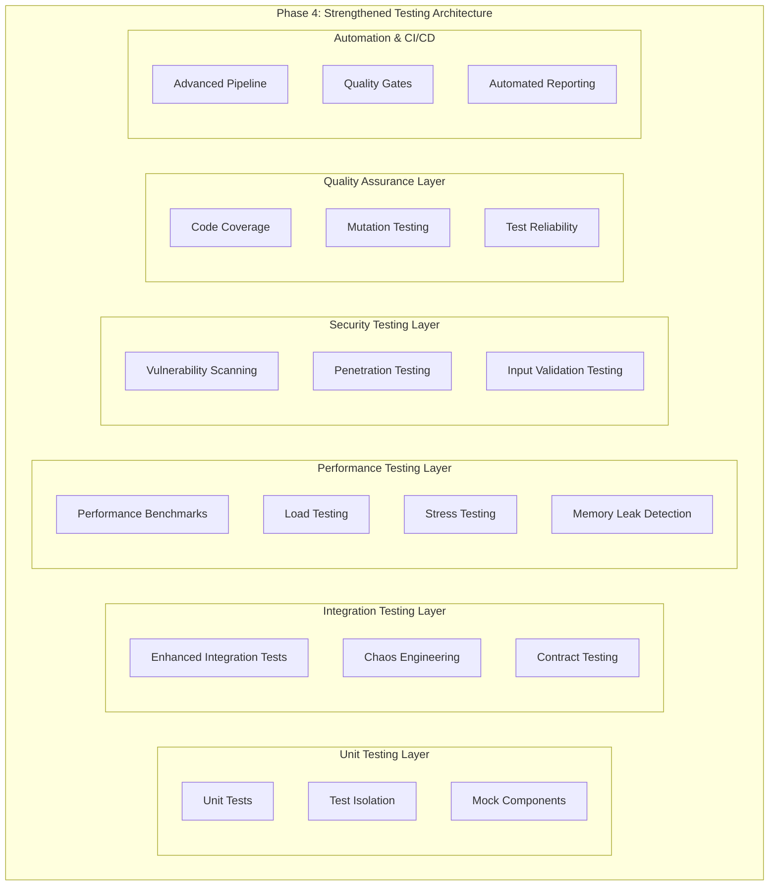

# Phase 4: Strengthened Testing - Comprehensive Architectural Plan

## Executive Summary

Phase 4 focuses on strengthening the testing infrastructure to ensure the unified architecture is robust, performant, and production-ready. Building upon the successful completion of Phases 1-3, this phase will establish industry-leading testing practices with comprehensive coverage, advanced automation, and continuous quality assurance.

## Current Testing State Analysis

### ✅ Existing Strengths
- **Comprehensive Test Suite**: 11 test files covering all 22 OpenAI Assistant tools
- **Cross-Deployment Validation**: Both Cloudflare Workers and NPM package deployments tested
- **Advanced Test Infrastructure**: Performance, error handling, edge cases, and deployment parity testing
- **Sophisticated Test Utilities**: Mock systems, data generators, and performance tracking
- **CI/CD Integration**: GitHub Actions workflow with 8 comprehensive jobs
- **Test Coverage Tools**: c8 coverage reporting already configured

### 🔍 Identified Gaps and Enhancement Opportunities

#### 1. **Unit Testing Coverage**
- **Current**: System-level integration tests only
- **Gap**: No isolated unit tests for individual components
- **Impact**: Difficult to pinpoint specific component failures

#### 2. **Test Isolation and Reliability**
- **Current**: Some shared state between tests
- **Gap**: Limited beforeEach/afterEach patterns
- **Impact**: Potential test interdependencies and flaky tests

#### 3. **Advanced Performance Testing**
- **Current**: Basic performance thresholds and timing
- **Gap**: No load testing, stress testing, or memory leak detection
- **Impact**: Unknown behavior under production load conditions

#### 4. **Security Testing**
- **Current**: Basic npm audit in CI/CD
- **Gap**: No penetration testing, input validation testing, or security scanning
- **Impact**: Potential security vulnerabilities undetected

#### 5. **Chaos Engineering**
- **Current**: Error handling tests for expected scenarios
- **Gap**: No chaos testing for unexpected failures
- **Impact**: Unknown system resilience under adverse conditions

#### 6. **Test Quality Assurance**
- **Current**: Code coverage reporting
- **Gap**: No mutation testing or test effectiveness validation
- **Impact**: Unknown quality of existing tests

## Phase 4 Architecture: Comprehensive Testing Framework

### 🏗️ Testing Architecture Overview

## Detailed Implementation Plan

### 🎯 Priority 1: Enhanced Unit Testing Framework

#### **Objective**: Establish comprehensive unit testing with proper isolation

**Implementation Strategy**:
1. **Test Framework Selection**: Implement Vitest for modern, fast unit testing
2. **Component Isolation**: Create unit tests for individual handlers, validators, and utilities
3. **Mock System Enhancement**: Advanced mocking for external dependencies
4. **Test Structure**: Implement proper beforeEach/afterEach patterns

**Deliverables**:
- `test/unit/` directory structure with component-specific tests
- Enhanced mock system with dependency injection
- Test isolation utilities and setup/teardown helpers
- Unit test coverage for all shared components

**Success Metrics**:
- 95%+ unit test coverage for shared components
- Zero test interdependencies
- Sub-100ms average unit test execution time

### 🎯 Priority 2: Advanced Integration Testing

#### **Objective**: Strengthen end-to-end testing with chaos engineering

**Implementation Strategy**:
1. **Chaos Engineering**: Implement failure injection and recovery testing
2. **Contract Testing**: Validate API contracts between components
3. **Environment Simulation**: Test various deployment scenarios
4. **Resilience Testing**: Network failures, timeouts, and resource constraints

**Deliverables**:
- Chaos testing framework with failure injection
- Contract testing for OpenAI API integration
- Multi-environment integration test suite
- Resilience testing scenarios

**Success Metrics**:
- 100% recovery from simulated failures
- All API contracts validated
- Cross-environment compatibility verified

### 🎯 Priority 3: Comprehensive Performance Testing

#### **Objective**: Establish production-ready performance validation

**Implementation Strategy**:
1. **Load Testing**: Simulate realistic production traffic
2. **Stress Testing**: Determine system breaking points
3. **Memory Profiling**: Detect memory leaks and optimization opportunities
4. **Performance Regression**: Continuous performance monitoring

**Deliverables**:
- Load testing framework with realistic scenarios
- Stress testing suite with breaking point analysis
- Memory profiling and leak detection tools
- Performance regression detection system

**Success Metrics**:
- Handle 1000+ concurrent requests without degradation
- Memory usage stable under sustained load
- Performance regression detection within 5% variance

### 🎯 Priority 4: Security Testing Pipeline

#### **Objective**: Ensure production-ready security posture

**Implementation Strategy**:
1. **Vulnerability Scanning**: Automated security vulnerability detection
2. **Input Validation Testing**: Comprehensive input sanitization validation
3. **Authentication Testing**: API key and authorization mechanism validation
4. **Dependency Security**: Enhanced dependency vulnerability monitoring

**Deliverables**:
- Automated vulnerability scanning pipeline
- Input validation test suite with edge cases
- Authentication and authorization test framework
- Enhanced dependency security monitoring

**Success Metrics**:
- Zero high-severity vulnerabilities
- 100% input validation coverage
- All authentication mechanisms validated

### 🎯 Priority 5: Test Quality Assurance

#### **Objective**: Validate and improve test effectiveness

**Implementation Strategy**:
1. **Mutation Testing**: Validate test quality through code mutation
2. **Test Coverage Analysis**: Comprehensive coverage reporting and analysis
3. **Test Reliability**: Flaky test detection and resolution
4. **Quality Gates**: Automated quality thresholds and enforcement

**Deliverables**:
- Mutation testing framework with quality metrics
- Enhanced coverage reporting with branch and condition coverage
- Flaky test detection and monitoring system
- Automated quality gates in CI/CD pipeline

**Success Metrics**:
- 95%+ mutation test score
- 98%+ code coverage (lines, branches, conditions)
- Zero flaky tests in CI/CD pipeline

### 🎯 Priority 6: Advanced CI/CD Integration

#### **Objective**: Automate comprehensive testing in deployment pipeline

**Implementation Strategy**:
1. **Pipeline Enhancement**: Expand CI/CD with new testing layers
2. **Parallel Execution**: Optimize test execution time through parallelization
3. **Quality Gates**: Implement strict quality thresholds
4. **Reporting Dashboard**: Comprehensive test result analytics

**Deliverables**:
- Enhanced GitHub Actions workflow with all testing layers
- Parallel test execution optimization
- Quality gate enforcement with failure thresholds
- Test analytics and reporting dashboard

**Success Metrics**:
- CI/CD pipeline completion under 15 minutes
- 100% quality gate enforcement
- Comprehensive test result visibility

## Implementation Timeline

### **Week 1-2: Foundation & Unit Testing**
- [ ] Set up enhanced unit testing framework
- [ ] Implement test isolation and mock systems
- [ ] Create unit tests for core components
- [ ] Establish test coverage baselines

### **Week 3-4: Integration & Performance**
- [ ] Implement chaos engineering framework
- [ ] Create advanced integration test scenarios
- [ ] Establish load and stress testing infrastructure
- [ ] Implement memory profiling and leak detection

### **Week 5-6: Security & Quality**
- [ ] Implement security testing pipeline
- [ ] Create vulnerability scanning automation
- [ ] Establish mutation testing framework
- [ ] Implement test quality metrics

### **Week 7-8: Automation & Optimization**
- [ ] Enhance CI/CD pipeline with new testing layers
- [ ] Implement parallel test execution
- [ ] Create quality gates and enforcement
- [ ] Establish test analytics dashboard

## Technical Specifications

### **Testing Framework Stack**
- **Unit Testing**: Vitest with TypeScript support
- **Integration Testing**: Enhanced custom framework
- **Performance Testing**: Artillery.js for load testing
- **Security Testing**: OWASP ZAP integration
- **Mutation Testing**: Stryker.js
- **Coverage**: c8 with enhanced reporting

### **Infrastructure Requirements**
- **Test Environments**: Docker containers for isolation
- **CI/CD**: Enhanced GitHub Actions with matrix strategies
- **Monitoring**: Test result analytics and alerting
- **Reporting**: Comprehensive dashboards and metrics

### **Quality Thresholds**
- **Unit Test Coverage**: 95% minimum
- **Integration Test Coverage**: 100% of critical paths
- **Performance**: <2s response time, 1000+ concurrent users
- **Security**: Zero high-severity vulnerabilities
- **Mutation Score**: 95% minimum

## Risk Assessment & Mitigation

### **High Priority Risks**
1. **Test Execution Time**: Comprehensive testing may slow CI/CD
   - **Mitigation**: Parallel execution and selective testing strategies

2. **Test Maintenance Overhead**: Extensive test suite requires maintenance
   - **Mitigation**: Automated test generation and maintenance tools

3. **False Positives**: Advanced testing may generate false alarms
   - **Mitigation**: Careful threshold tuning and validation

### **Medium Priority Risks**
1. **Resource Requirements**: Enhanced testing requires more compute resources
   - **Mitigation**: Efficient resource allocation and cloud scaling

2. **Complexity**: Advanced testing framework increases system complexity
   - **Mitigation**: Comprehensive documentation and training

## Success Criteria

### **Quantitative Metrics**
- [ ] 95%+ unit test coverage across all components
- [ ] 100% integration test coverage for critical paths
- [ ] <15 minute CI/CD pipeline execution time
- [ ] 1000+ concurrent user load capacity
- [ ] Zero high-severity security vulnerabilities
- [ ] 95%+ mutation test score

### **Qualitative Metrics**
- [ ] Production-ready confidence in system reliability
- [ ] Comprehensive test automation reducing manual effort
- [ ] Enhanced developer productivity through fast feedback
- [ ] Robust quality assurance preventing regressions
- [ ] Industry-leading testing practices implementation

## Conclusion

Phase 4: Strengthened Testing will establish the OpenAI Assistants MCP Server as a production-ready, enterprise-grade system with comprehensive quality assurance. The implementation will provide confidence in system reliability, performance, and security while maintaining the unified architecture achieved in previous phases.

The testing framework will serve as a foundation for future development, ensuring that new features and modifications maintain the high quality standards established through this comprehensive testing initiative.

---

**Next Steps**: Review and approve this plan, then proceed with implementation starting with Priority 1: Enhanced Unit Testing Framework.