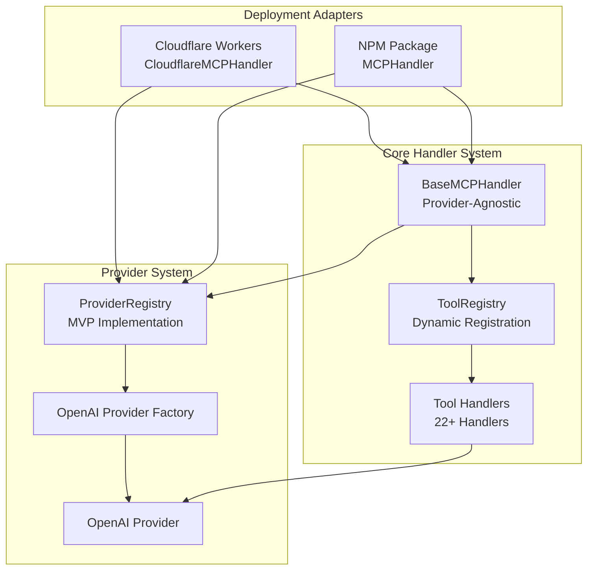

# Provider System Architecture - Jezweb MCP Core

## Overview

Jezweb MCP Core features a sophisticated **provider-agnostic architecture** that abstracts away LLM provider-specific details while maintaining a unified interface. This document explains the provider system, configuration approach, and extensibility patterns.

## Core Design Principles

### 1. **Adaptable**
- Support for multiple LLM providers (OpenAI, Anthropic, Google, etc.)
- Unified interface regardless of underlying provider
- Easy addition of new providers without breaking changes

### 2. **Simple**
- Environment-first configuration
- Sensible defaults that work out-of-the-box
- No complex configuration files or schemas

### 3. **Lightweight**
- Minimal dependencies and fast execution
- Efficient provider selection and management
- Low memory footprint

### 4. **Extensible**
- Plugin-like provider system
- Clear interfaces for adding new capabilities
- Future-ready architecture

## Architecture Components

### Provider Registry System

The `ProviderRegistry` is the central component that manages all LLM providers:

```typescript
interface ProviderRegistry {
  // Provider lifecycle management
  registerProvider(provider: LLMProvider): Promise<void>;
  unregisterProvider(providerName: string): Promise<void>;
  
  // Provider selection strategies
  selectProvider(context: ProviderSelectionContext): LLMProvider;
  getDefaultProvider(): LLMProvider | undefined;
  
  // Health monitoring
  getProviderStatus(providerName: string): LLMProviderStatus;
  getStatistics(): RegistryStatistics;
}
```

### Generic LLM Provider Interface

All providers implement the same interface, ensuring consistency:

```typescript
interface LLMProvider {
  readonly metadata: LLMProviderMetadata;
  
  // Lifecycle
  initialize(config: Record<string, any>): Promise<void>;
  validateConnection(): Promise<boolean>;
  
  // Assistant API methods (unified across providers)
  createAssistant(request: GenericCreateAssistantRequest): Promise<GenericAssistant>;
  listAssistants(request?: GenericListRequest): Promise<GenericListResponse<GenericAssistant>>;
  // ... all other assistant API methods
}
```

### Provider Selection Strategies

The system supports multiple provider selection strategies:

- **Default**: Use the configured default provider
- **Priority**: Select highest priority available provider
- **Round-Robin**: Rotate between available providers
- **Capability-Based**: Select based on required capabilities
- **Health-Based**: Select the healthiest provider

```typescript
const provider = registry.selectProvider({
  strategy: 'capability-based',
  requiredCapabilities: ['assistants', 'streaming'],
  preferredProvider: 'openai'
});
```

## Configuration System

### ✅ Implemented Configuration Structure

The configuration system has been implemented with a simplified, environment-first approach:

```typescript
// Current Implementation - SimpleMCPHandlerConfig
interface SimpleMCPHandlerConfig {
  /** OpenAI API key (for backward compatibility) */
  apiKey?: string;
  /** Server name for identification */
  serverName?: string;
  /** Server version */
  serverVersion?: string;
  /** Enable debug logging */
  debug?: boolean;
  /** Custom capabilities */
  capabilities?: {
    tools?: { listChanged?: boolean };
    resources?: { subscribe?: boolean; listChanged?: boolean };
    prompts?: { listChanged?: boolean };
    completions?: {};
  };
}

// Provider Registry Configuration (MVP)
interface ProviderRegistryConfig {
  /** Default provider name to use */
  defaultProvider?: string;
  /** Provider configurations */
  providers: LLMProviderConfig[];
}
```

### ✅ Environment-First Configuration

Configuration prioritizes environment variables with sensible defaults:

```bash
# Required configuration
OPENAI_API_KEY=your-openai-key

# Optional configuration with defaults
SERVER_NAME=openai-assistants-mcp          # Default server name
SERVER_VERSION=3.0.1                       # Default version
DEBUG=true                                  # Enable debug logging
MCP_DEBUG=true                             # Alternative debug flag
```

### ✅ Implemented Configuration Loading

The configuration loading has been implemented in both deployment adapters:

#### Cloudflare Workers Configuration
```typescript
// src/mcp-handler.ts - Actual Implementation
const config: SimpleMCPHandlerConfig = {
  apiKey: env.OPENAI_API_KEY,
  serverName: env.SERVER_NAME || 'openai-assistants-mcp',
  serverVersion: env.SERVER_VERSION || '3.0.1',
  debug: env.DEBUG === 'true',
  capabilities: {
    tools: { listChanged: false },
    resources: { subscribe: false, listChanged: false },
    prompts: { listChanged: false },
    completions: {},
  },
};

// Provider Registry Configuration
const registryConfig: ProviderRegistryConfig = {
  defaultProvider: 'openai',
  providers: [
    {
      provider: 'openai',
      enabled: true,
      config: { apiKey: env.OPENAI_API_KEY },
    },
  ],
};
```

#### NPM Package Configuration
```typescript
// npm-package/src/mcp-handler.ts - Actual Implementation
const config: SimpleMCPHandlerConfig = {
  apiKey: apiKey,
  serverName: process.env.MCP_SERVER_NAME || 'jezweb-mcp-core',
  serverVersion: process.env.MCP_SERVER_VERSION || '3.0.1',
  debug: process.env.DEBUG === 'true' || process.env.MCP_DEBUG === 'true',
  capabilities: {
    tools: { listChanged: false },
    resources: { subscribe: false, listChanged: false },
    prompts: { listChanged: false },
    completions: {},
  },
};
```

### ✅ Configuration Loading Process (Implemented)

1. **✅ Load Defaults**: Sensible defaults applied in constructor
2. **✅ Apply Environment Variables**: Environment variables override defaults
3. **✅ Validate Configuration**: API key validation and error handling
4. **✅ Initialize Providers**: ProviderRegistry created and initialized
5. **✅ Handler Integration**: BaseMCPHandler receives configured registry

```typescript
// Actual Implementation Pattern
constructor(env: Env) {
  // 1. Validate required configuration
  if (!env.OPENAI_API_KEY) {
    throw new Error('OPENAI_API_KEY is required');
  }

  // 2. Create configuration with defaults
  const config = { /* ... with defaults ... */ };

  // 3. Create and initialize provider registry
  const providerRegistry = this.createProviderRegistry(env);

  // 4. Initialize base handler with registry
  super(config, providerRegistry);
}
```

## Provider Implementation

### Adding a New Provider

To add a new LLM provider, implement the `LLMProvider` interface:

```typescript
class MyCustomProvider implements LLMProvider {
  readonly metadata: LLMProviderMetadata = {
    name: 'my-provider',
    displayName: 'My Custom Provider',
    version: '1.0.0',
    description: 'Custom LLM provider implementation',
    capabilities: {
      assistants: true,
      threads: true,
      messages: true,
      runs: true,
      runSteps: true,
      streaming: false,
      maxContextLength: 8192,
      supportedModels: ['my-model-1', 'my-model-2']
    }
  };

  async initialize(config: Record<string, any>): Promise<void> {
    // Initialize provider with configuration
  }

  async validateConnection(): Promise<boolean> {
    // Validate provider connectivity
  }

  // Implement all required assistant API methods
  async createAssistant(request: GenericCreateAssistantRequest): Promise<GenericAssistant> {
    // Provider-specific implementation
  }
  
  // ... implement all other methods
}
```

### Provider Factory Pattern

Create a factory for your provider:

```typescript
class MyCustomProviderFactory implements LLMProviderFactory {
  async create(config: Record<string, any>): Promise<LLMProvider> {
    const provider = new MyCustomProvider();
    await provider.initialize(config);
    return provider;
  }

  getMetadata(): LLMProviderMetadata {
    return new MyCustomProvider().metadata;
  }

  validateConfig(config: Record<string, any>): boolean {
    return config.apiKey && typeof config.apiKey === 'string';
  }
}
```

### Register the Provider

Register your provider with the registry:

```typescript
const registry = getGlobalProviderRegistry();
registry.registerFactory(new MyCustomProviderFactory());
```

## Provider Capabilities System

### Capability Definition

Providers declare their capabilities through metadata:

```typescript
interface LLMCapabilities {
  assistants: boolean;        // Assistant management
  threads: boolean;          // Thread management
  messages: boolean;         // Message management
  runs: boolean;             // Run execution
  runSteps: boolean;         // Run step inspection
  fileAttachments?: boolean; // File attachment support
  functionCalling?: boolean; // Function calling
  codeInterpreter?: boolean; // Code interpretation
  fileSearch?: boolean;      // File search
  streaming?: boolean;       // Streaming responses
  customModels?: boolean;    // Custom model support
  maxContextLength?: number; // Maximum context length
  supportedModels?: string[]; // Supported model names
}
```

### Capability-Based Selection

The registry can select providers based on required capabilities:

```typescript
const provider = registry.selectProvider({
  strategy: 'capability-based',
  requiredCapabilities: ['assistants', 'streaming', 'functionCalling']
});
```

## Health Monitoring

### Provider Health Checks

The registry continuously monitors provider health:

```typescript
interface LLMProviderStatus {
  name: string;
  available: boolean;
  healthy: boolean;
  lastHealthCheck?: Date;
  error?: string;
  statusData?: Record<string, any>;
}
```

### Health Check Process

1. **Periodic Checks**: Automatic health checks at configured intervals
2. **Connection Validation**: Validate provider connectivity
3. **Status Updates**: Update provider status based on health check results
4. **Event Emission**: Emit events when provider status changes

### Registry Statistics

Monitor overall registry health:

```typescript
interface RegistryStatistics {
  totalProviders: number;
  availableProviders: number;
  healthyProviders: number;
  defaultProvider?: string;
  providerStatus: Record<string, LLMProviderStatus>;
  lastUpdated: Date;
}
```

## Error Handling

### Provider Error Handling

Standardized error handling across all providers:

```typescript
class LLMProviderError extends MCPError {
  constructor(
    public providerName: string,
    code: number,
    message: string,
    public originalError?: any
  ) {
    super(code, `[${providerName}] ${message}`);
  }
}
```

### Graceful Degradation

The system handles provider failures gracefully:

1. **Automatic Fallback**: Switch to backup providers when primary fails
2. **Error Context**: Provide detailed error information with provider context
3. **Retry Logic**: Automatic retry with exponential backoff
4. **Circuit Breaker**: Temporarily disable failing providers

## Deployment Adapters

### Shared Core Architecture

The system uses a "Shared Core with Thin Adapters" pattern:

```
shared/core/           # Business logic (provider-agnostic)
├── handlers/          # Tool handlers
├── base-mcp-handler.ts # MCP protocol implementation
└── tool-registry.ts   # Tool registration

src/                   # Cloudflare Workers adapter
├── worker.ts          # Workers-specific entry point
└── mcp-handler.ts     # Workers-specific MCP handling

npm-package/           # NPM package adapter
├── src/               # NPM-specific implementation
└── universal-mcp-server.cjs # NPM entry point
```

### Adapter Pattern Benefits

1. **Code Reuse**: Single implementation shared across deployments
2. **Consistency**: Identical behavior across deployment options
3. **Maintainability**: Changes in one place affect all deployments
4. **Testing**: Single test suite validates all deployments

## Future Extensibility

### Plugin Architecture

The provider system is designed for future plugin support:

```typescript
interface ProviderPlugin {
  name: string;
  version: string;
  install(registry: ProviderRegistry): Promise<void>;
  uninstall(registry: ProviderRegistry): Promise<void>;
}
```

### Custom Capabilities

Providers can define custom capabilities:

```typescript
interface CustomCapabilities extends LLMCapabilities {
  customFeature?: boolean;
  specialModel?: string;
  advancedOptions?: Record<string, any>;
}
```

### Configuration Extensions

The configuration system supports extensions:

```typescript
interface ExtendedConfig extends JezwebConfig {
  plugins?: PluginConfig[];
  customProviders?: CustomProviderConfig[];
  advancedFeatures?: AdvancedFeatureConfig;
}
```

## Best Practices

### Provider Implementation

1. **Implement All Methods**: Even if not supported, provide graceful handling
2. **Validate Inputs**: Comprehensive input validation with helpful errors
3. **Handle Errors Gracefully**: Convert provider-specific errors to standard format
4. **Support Capabilities**: Accurately declare provider capabilities
5. **Monitor Health**: Implement robust health checking

### Configuration Management

1. **Environment First**: Prioritize environment variables
2. **Sensible Defaults**: Provide defaults that work out-of-the-box
3. **Clear Validation**: Provide helpful validation error messages
4. **Documentation**: Document all configuration options

### Registry Usage

1. **Use Selection Strategies**: Leverage appropriate selection strategies
2. **Monitor Health**: Check provider health before critical operations
3. **Handle Failures**: Implement proper error handling and fallbacks
4. **Event Handling**: Listen to registry events for monitoring

## Implementation Status

### ✅ Completed Architectural Unification

The provider-agnostic architecture has been **fully implemented** and integrated into the core system:

#### 1. **BaseMCPHandler Integration** ✅
- **COMPLETED**: BaseMCPHandler now uses ProviderRegistry instead of direct OpenAIService instantiation
- **Constructor Updated**: Accepts `ProviderRegistry` as a parameter with backward compatibility
- **Provider Selection**: Uses registry to get default provider for each request
- **Context Updates**: Tool handlers receive generic `LLMProvider` interface

#### 2. **Deployment Adapter Updates** ✅
- **Cloudflare Workers**: `CloudflareMCPHandler` creates and initializes ProviderRegistry
- **NPM Package**: `MCPHandler` creates and initializes ProviderRegistry
- **Backward Compatibility**: Both adapters maintain existing constructor signatures
- **Async Initialization**: Proper async initialization patterns implemented

#### 3. **ProviderRegistry MVP Implementation** ✅
- **Simplified Architecture**: MVP implementation focused on core functionality
- **Provider Registration**: Factory-based provider registration system
- **Default Provider Selection**: Simple default provider selection strategy
- **Configuration Support**: Environment-based configuration integration

#### 4. **Tool Handler Architecture** ✅
- **Generic Provider Interface**: All 22+ tool handlers now use `LLMProvider` interface
- **ToolHandlerContext Updated**: Context now contains generic provider instead of OpenAIService
- **Dynamic Registration**: Removed hardcoded tool count assumptions
- **Provider-Agnostic Execution**: Tools work with any provider implementing the interface

#### 5. **Type System Integration** ✅
- **Generic Types**: Comprehensive generic type system for provider-agnostic operations
- **Type Mapping**: Utilities to convert between provider-specific and generic types
- **Backward Compatibility**: Maintains compatibility with existing OpenAI types
- **Provider Data Preservation**: Preserves provider-specific data during conversions

### Current Architecture Flow



### Migration Path - COMPLETED

#### ✅ From OpenAI-Specific Implementation

The architectural unification has been completed while maintaining 100% backward compatibility:

1. **✅ Existing Configuration**: Old environment variables continue to work
2. **✅ Same Interface**: All existing tools and methods remain unchanged
3. **✅ Transparent Operation**: Users don't need to change their usage patterns
4. **✅ Gradual Enhancement**: New provider system works alongside existing patterns

#### ✅ Provider System Integration

The provider system is now fully integrated:

1. **✅ Registry Initialization**: Both deployment adapters create and initialize ProviderRegistry
2. **✅ Provider Registration**: OpenAI provider factory registered and initialized
3. **✅ Handler Integration**: BaseMCPHandler uses registry for provider selection
4. **✅ Tool Execution**: All tools execute through generic provider interface

### Next Steps - Future Extensibility

With the core architecture now unified, future enhancements can include:

#### 🔄 Advanced Provider Features (Currently MVP)
- **Health Monitoring**: Automatic provider health checks and status tracking
- **Selection Strategies**: Priority-based, round-robin, and capability-based selection
- **Event System**: Provider status change notifications and monitoring
- **Retry Logic**: Automatic retry with exponential backoff for failed operations

#### 🔄 Additional Providers
- **Anthropic Provider**: Claude integration using the established factory pattern
- **Google Provider**: Gemini integration with the same interface
- **Custom Providers**: Plugin-like architecture for third-party providers

#### 🔄 Configuration Enhancements
- **Multi-Provider Config**: Support for multiple simultaneous providers
- **Dynamic Configuration**: Runtime provider configuration updates
- **Advanced Selection**: Context-aware provider selection based on request type

### Architecture Benefits Realized

1. **✅ Unified Codebase**: Single implementation shared across all deployment targets
2. **✅ Provider Abstraction**: Generic interface enables future provider additions
3. **✅ Backward Compatibility**: Existing users experience no breaking changes
4. **✅ Simplified Maintenance**: Changes in one place affect all deployments
5. **✅ Enhanced Testability**: Provider system enables comprehensive testing strategies

This architecture provides a solid, production-ready foundation for supporting multiple LLM providers while maintaining simplicity and extensibility.