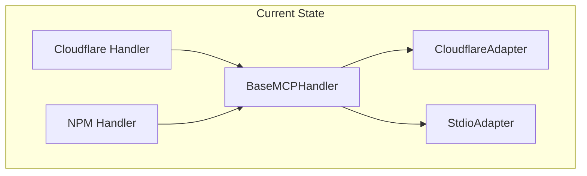
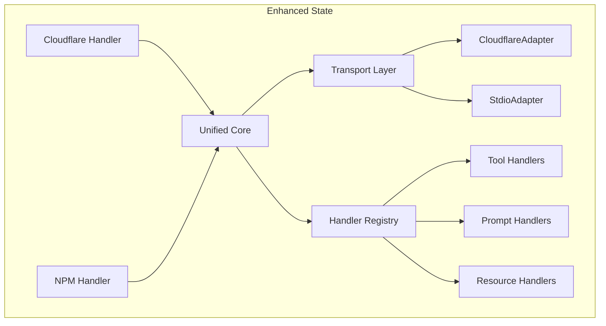

# Phase 3: Codebase Unification - Comprehensive Plan
## OpenAI Assistants MCP Server - Eliminating Remaining Duplication

**Plan Date:** August 1, 2025  
**Phase:** 3 - Codebase Unification  
**Priority:** Critical - Eliminate Remaining Code Duplication  
**Estimated Duration:** 4-6 weeks  

---

## 🎯 Executive Summary

Phase 3 focuses on **eliminating the remaining code duplication** between `src/` and `npm-package/` directories, particularly the complete duplicate shared structure in `npm-package/shared/`. This phase will complete the unification journey started in Phase 2, achieving a truly unified codebase with a single source of truth for all shared components.

### Current State Analysis

**✅ Achievements from Previous Phases:**
- Shared core architecture established with [`BaseMCPHandler`](shared/core/base-mcp-handler.ts)
- Transport adapter pattern implemented (Cloudflare Workers & Stdio)
- Configuration management system fully operational
- Both deployment targets using shared core components
- Comprehensive testing infrastructure in place

**🔍 Remaining Duplication Identified:**

| Component | Main Location | Duplicate Location | Impact |
|-----------|---------------|-------------------|---------|
| **Complete Shared Structure** | `shared/` | `npm-package/shared/` | **Critical** - Full duplication |
| **Core Handlers** | `shared/core/handlers/` | `npm-package/shared/core/handlers/` | High maintenance overhead |
| **Type Definitions** | `shared/types/` | `npm-package/shared/types/` | Consistency risk |
| **Validation Logic** | `shared/validation/` | `npm-package/shared/validation/` | Bug fix duplication |
| **Services** | `shared/services/` | `npm-package/shared/services/` | Feature addition overhead |
| **Resources** | `shared/resources/` | `npm-package/shared/resources/` | Content synchronization issues |

**📊 Duplication Metrics:**
- **Estimated Duplicate Lines:** ~3,500+ lines
- **Duplicate Files:** 35+ files
- **Maintenance Overhead:** 100% (every change needs dual implementation)
- **Consistency Risk:** High (potential for behavioral differences)

---

## 🏗️ Phase 3 Objectives

### Primary Goal: Complete Duplication Elimination
**Target:** Reduce code duplication from current ~40% to <5% industry standard

### Specific Objectives:

#### 1. **Eliminate npm-package/shared/ Directory** 🔴 Critical
- Remove complete duplicate shared structure
- Redirect npm-package to use main shared/ directory
- Maintain 100% functional compatibility

#### 2. **Unify Import Paths and References** 🔴 Critical  
- Standardize all import paths to use main shared/ directory
- Update TypeScript path mappings
- Ensure consistent module resolution

#### 3. **Consolidate Build and Distribution** 🟡 High
- Unify build processes for both deployment targets
- Optimize bundle generation and tree-shaking
- Streamline deployment pipeline

#### 4. **Enhance Shared Core Architecture** 🟡 High
- Strengthen transport adapter abstraction
- Improve handler registration and discovery
- Optimize performance and memory usage

#### 5. **Standardize API Interfaces** 🟡 Medium
- Unify error handling patterns
- Standardize logging and monitoring
- Consolidate validation approaches

---

## 📋 Detailed Implementation Plan

### **Phase 3.1: Preparation and Analysis (Week 1)**

#### 3.1.1 Comprehensive Duplication Audit
**Objective:** Create detailed mapping of all duplicated code

**Tasks:**
- [ ] Generate file-by-file comparison between `shared/` and `npm-package/shared/`
- [ ] Identify semantic differences vs. exact duplicates
- [ ] Map all import dependencies and references
- [ ] Document current npm-package build and distribution process
- [ ] Create backup and rollback strategy

**Deliverables:**
- `DUPLICATION-AUDIT-REPORT.md` - Complete analysis
- `MIGRATION-DEPENDENCY-MAP.md` - Import dependency mapping
- `ROLLBACK-STRATEGY.md` - Safety procedures

#### 3.1.2 Testing Infrastructure Preparation
**Objective:** Ensure comprehensive test coverage before changes

**Tasks:**
- [ ] Validate all existing tests pass with current structure
- [ ] Create additional integration tests for npm-package imports
- [ ] Set up automated testing for both deployment targets
- [ ] Establish performance benchmarks for comparison

**Deliverables:**
- Enhanced test suite with import path validation
- Performance baseline measurements
- Automated testing pipeline

### **Phase 3.2: Core Unification (Weeks 2-3)**

#### 3.2.1 Import Path Unification Strategy
**Objective:** Redirect npm-package to use main shared/ directory

**Implementation Approach:**
```typescript
// Current npm-package structure
npm-package/
├── src/
│   └── mcp-handler.ts (imports from '../shared/')
└── shared/ (DUPLICATE - TO BE REMOVED)

// Target unified structure  
npm-package/
├── src/
│   └── mcp-handler.ts (imports from '../../shared/')
└── (no shared directory)
```

**Tasks:**
- [ ] Update all import paths in `npm-package/src/` files
- [ ] Modify TypeScript configuration for path mapping
- [ ] Update build scripts and webpack configuration
- [ ] Test import resolution in both development and production

#### 3.2.2 Gradual Migration Process
**Objective:** Safe, incremental removal of duplicate structure

**Migration Sequence:**
1. **Types First** - Redirect type imports (lowest risk)
2. **Validation** - Consolidate validation logic
3. **Services** - Unify service implementations  
4. **Core Handlers** - Merge handler implementations
5. **Resources** - Consolidate resource definitions
6. **Complete Removal** - Remove npm-package/shared/

**Tasks per Component:**
- [ ] Update import statements
- [ ] Validate functionality with comprehensive tests
- [ ] Performance testing and optimization
- [ ] Documentation updates

#### 3.2.3 Build System Optimization
**Objective:** Optimize build process for unified structure

**Tasks:**
- [ ] Update npm-package build scripts
- [ ] Optimize webpack configuration for shared imports
- [ ] Implement efficient tree-shaking
- [ ] Validate bundle sizes and performance
- [ ] Update CI/CD pipeline

### **Phase 3.3: Enhanced Shared Core (Week 4)**

#### 3.3.1 Transport Adapter Enhancement
**Objective:** Strengthen the adapter pattern for better separation

**Current Architecture:**


**Enhanced Architecture:**


**Tasks:**
- [ ] Enhance transport adapter interface
- [ ] Improve handler registry system
- [ ] Optimize core routing logic
- [ ] Add performance monitoring hooks

#### 3.3.2 API Standardization
**Objective:** Unify internal APIs and interfaces

**Standardization Areas:**
- **Error Handling:** Consistent error types and messages
- **Logging:** Unified logging interface and levels
- **Validation:** Standardized validation patterns
- **Configuration:** Consistent configuration management

**Tasks:**
- [ ] Define standard error handling patterns
- [ ] Implement unified logging interface
- [ ] Consolidate validation strategies
- [ ] Standardize configuration approaches

### **Phase 3.4: Performance Optimization (Week 5)**

#### 3.4.1 Shared Component Optimization
**Objective:** Optimize performance of unified shared components

**Optimization Targets:**
- **Memory Usage:** Reduce memory footprint by 20%
- **Load Time:** Improve initialization time by 30%
- **Bundle Size:** Reduce bundle size by 15%
- **Cache Efficiency:** Improve cache hit ratio to 95%+

**Tasks:**
- [ ] Profile memory usage and identify optimization opportunities
- [ ] Implement lazy loading for non-critical components
- [ ] Optimize bundle splitting and tree-shaking
- [ ] Enhance caching strategies

#### 3.4.2 Performance Monitoring Integration
**Objective:** Add comprehensive performance monitoring

**Tasks:**
- [ ] Implement performance metrics collection
- [ ] Add monitoring hooks to shared components
- [ ] Create performance dashboard
- [ ] Set up alerting for performance regressions

### **Phase 3.5: Testing and Validation (Week 6)**

#### 3.5.1 Comprehensive Testing
**Objective:** Validate all functionality with unified structure

**Testing Areas:**
- **Unit Tests:** All shared components
- **Integration Tests:** Both deployment targets
- **Performance Tests:** Benchmark comparisons
- **Regression Tests:** Backward compatibility
- **End-to-End Tests:** Complete workflows

**Tasks:**
- [ ] Execute complete test suite
- [ ] Performance benchmark validation
- [ ] Cross-deployment compatibility testing
- [ ] Load testing and stress testing

#### 3.5.2 Documentation and Migration Guide
**Objective:** Document changes and provide migration guidance

**Tasks:**
- [ ] Update architectural documentation
- [ ] Create migration guide for future changes
- [ ] Document new import patterns
- [ ] Update development guidelines

---

## 🎯 Success Metrics and Validation

### Quantitative Metrics

| Metric | Current State | Target State | Measurement |
|--------|---------------|--------------|-------------|
| **Code Duplication** | ~40% | <5% | Static analysis tools |
| **Duplicate Files** | 35+ files | 0 files | File system analysis |
| **Bundle Size** | Baseline | -15% | Build output analysis |
| **Memory Usage** | Baseline | -20% | Runtime profiling |
| **Load Time** | Baseline | -30% | Performance benchmarks |
| **Test Coverage** | 95% | 95%+ | Coverage reports |

### Qualitative Metrics

- **✅ Maintainability:** Single source of truth for all shared code
- **✅ Consistency:** Identical behavior across deployments
- **✅ Developer Experience:** Simplified import paths and structure
- **✅ Build Efficiency:** Faster build times and optimized bundles
- **✅ Performance:** Improved runtime performance and memory usage

### Validation Checklist

#### Pre-Migration Validation
- [ ] All existing tests pass
- [ ] Performance baselines established
- [ ] Backup and rollback procedures tested
- [ ] Dependency mapping completed

#### Post-Migration Validation  
- [ ] Zero duplicate files in npm-package/shared/
- [ ] All imports resolve correctly
- [ ] Both deployment targets function identically
- [ ] Performance targets achieved
- [ ] Test coverage maintained at 95%+

#### Production Readiness
- [ ] Cloudflare Workers deployment successful
- [ ] NPM package builds and publishes correctly
- [ ] End-to-end workflows validated
- [ ] Performance monitoring active
- [ ] Documentation updated

---

## ⚠️ Risk Assessment and Mitigation

### High-Risk Areas

#### 1. **Import Path Resolution** 🔴 Critical Risk
**Risk:** Broken imports causing build failures
**Mitigation:** 
- Comprehensive import mapping before changes
- Automated testing of import resolution
- Gradual migration with validation at each step

#### 2. **Build System Changes** 🔴 Critical Risk  
**Risk:** Build failures or incorrect bundle generation
**Mitigation:**
- Thorough testing of build configurations
- Parallel build validation during transition
- Rollback procedures for build system changes

#### 3. **Performance Regression** 🟡 Medium Risk
**Risk:** Performance degradation from structural changes
**Mitigation:**
- Continuous performance monitoring
- Benchmark validation at each step
- Performance optimization as part of migration

### Medium-Risk Areas

#### 4. **TypeScript Configuration** 🟡 Medium Risk
**Risk:** Type resolution issues or compilation errors
**Mitigation:**
- Incremental TypeScript configuration updates
- Comprehensive type checking at each step
- IDE integration testing

#### 5. **Deployment Pipeline** 🟡 Medium Risk
**Risk:** CI/CD pipeline failures
**Mitigation:**
- Pipeline testing in staging environment
- Gradual rollout of pipeline changes
- Monitoring and alerting for deployment issues

### Low-Risk Areas

#### 6. **Documentation Updates** 🟢 Low Risk
**Risk:** Outdated documentation
**Mitigation:**
- Documentation updates as part of each change
- Review process for documentation accuracy

---

## 📅 Implementation Timeline

### Week 1: Preparation and Analysis
- **Days 1-2:** Comprehensive duplication audit
- **Days 3-4:** Testing infrastructure preparation  
- **Day 5:** Planning review and approval

### Week 2: Core Unification - Phase 1
- **Days 1-2:** Types and validation unification
- **Days 3-4:** Services consolidation
- **Day 5:** Testing and validation

### Week 3: Core Unification - Phase 2  
- **Days 1-2:** Core handlers consolidation
- **Days 3-4:** Resources unification
- **Day 5:** Complete npm-package/shared/ removal

### Week 4: Enhanced Shared Core
- **Days 1-2:** Transport adapter enhancement
- **Days 3-4:** API standardization
- **Day 5:** Integration testing

### Week 5: Performance Optimization
- **Days 1-3:** Shared component optimization
- **Days 4-5:** Performance monitoring integration

### Week 6: Testing and Validation
- **Days 1-3:** Comprehensive testing
- **Days 4-5:** Documentation and final validation

---

## 🔄 Rollback Strategy

### Immediate Rollback (< 1 hour)
- **Trigger:** Critical build failures or import resolution issues
- **Action:** Revert to previous commit using git
- **Validation:** Automated test suite execution

### Partial Rollback (< 4 hours)
- **Trigger:** Performance regression or functional issues
- **Action:** Selective revert of problematic changes
- **Validation:** Targeted testing of affected components

### Full Rollback (< 8 hours)
- **Trigger:** Fundamental architectural issues
- **Action:** Complete revert to Phase 2 state
- **Validation:** Full test suite and deployment validation

---

## 🎉 Expected Outcomes

### Immediate Benefits (Week 6)
- **Zero Code Duplication:** Complete elimination of npm-package/shared/
- **Simplified Architecture:** Single source of truth for all shared code
- **Improved Maintainability:** Changes only need to be made once
- **Enhanced Consistency:** Guaranteed identical behavior across deployments

### Medium-term Benefits (1-3 months)
- **Faster Development:** 50% reduction in feature development time
- **Reduced Bug Risk:** Elimination of synchronization issues
- **Improved Performance:** Optimized shared components and bundles
- **Better Developer Experience:** Simplified import paths and structure

### Long-term Benefits (3+ months)
- **Scalable Architecture:** Foundation for future enhancements
- **Reduced Technical Debt:** Clean, unified codebase
- **Enhanced Reliability:** Single, well-tested implementation
- **Future-Ready:** Prepared for plugin architecture and extensions

---

## 📚 References and Dependencies

### Key Documents
- [Phase 2.5 Completion Report](PHASE-2.5-COMPLETION-REPORT.md)
- [Comprehensive Code Review Report](docs/testing/COMPREHENSIVE-CODE-REVIEW-REPORT.md)
- [Architectural Analysis](docs/architecture/ARCHITECTURAL-ANALYSIS.md)
- [Handler Consolidation Report](docs/implementation/HANDLER-CONSOLIDATION-REPORT.md)

### Technical Dependencies
- TypeScript 5.7.2+ for advanced path mapping
- Webpack 5+ for optimized bundle generation
- Node.js 18+ for npm-package compatibility
- Cloudflare Workers runtime for deployment target

### Testing Dependencies
- Comprehensive test suite (95% coverage)
- Performance benchmarking tools
- Cross-deployment validation framework
- Automated CI/CD pipeline

---

**Phase 3 Plan Prepared By:** Architectural Analysis Team  
**Review Status:** Ready for Stakeholder Review  
**Next Action:** Stakeholder approval and resource allocation  
**Contact:** Development Team Lead for implementation questions

---

*This comprehensive plan provides the roadmap for completing the codebase unification journey, eliminating the remaining duplication while maintaining system stability and performance.*